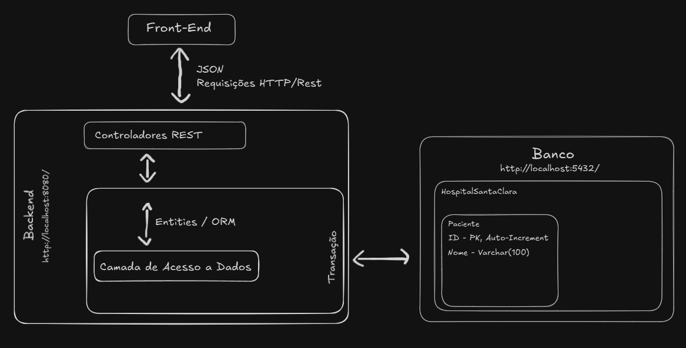

# Projeto Hospital Santa Clara
## API REST para cadastrar Pacientes - Trabalho FMU

"Projeto de gerenciamento de pacientes com integração ao banco de dados PostgreSQL, desenvolvido em Java com Spring Boot."

### Arquitetura Implementada


---

## Funcionalidades

- Cadastro de pacientes com nome e ID auto-incrementado.
- Persistência de dados no PostgreSQL.
- API REST para gerenciar pacientes - Endpoints (POST / DELETE).

---

## 🛠️ Tecnologias Utilizadas

- **Java** (Spring Boot)
- **PostgreSQL**
- **Maven** para gerenciamento de dependências
- **IntelliJ IDEA** como IDE

---

## 📦 Pré-requisitos

Antes de iniciar, você precisará ter instalado:

- **Java 17+**
- **PostgreSQL**
- **Maven**
- **Git**

---

## 🔧 Configuração do Banco de Dados

1. Certifique-se de que o PostgreSQL está rodando.
2. Crie um banco de dados:
   ```bash
   psql -U seu_usuario
   CREATE DATABASE seu_banco_de_dados;

3. Atualize o arquivo application.properties ou application.yml com suas credenciais:
   properties
   ```bash
   spring.datasource.url=jdbc:postgresql://localhost:5432/seu_banco_de_dados
   spring.datasource.username=seu_usuario
   spring.datasource.password=sua_senha

---
## 🚀 Como Executar o Projeto

1. Clone o repositório:
   ```bash
   git clone https://github.com/RenanBeraldi/dev-web-backend.git
   cd nome-do-repositorio

2. Compile e Inicie o Projeto:
    ```bash
   mvn spring-boot:run
   
3. Acesse a Aplicação via `http://localhost:8080.`

---
## 📖 Endpoints Disponíveis

### **POST /pacientes**
- Adiciona um novo paciente ao banco de dados.
- **Requisição:**
    - **URL:** `http://localhost:8080/pacientes`
    - **Método:** `POST`
  - **Corpo da requisição:**
    ```json
    {
      "fullName": "João Silva"
    }
    ```
- **Resposta:**
  ```json
  {
    "id": 1,
    "fullName": "João Silva"
  }